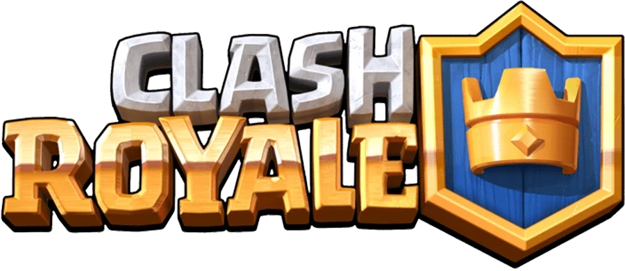

<div align='center'>
  
</div>

## 🏋️‍♂️ Sobre o Projeto

### Explore todas as cartas disponíveis no universo do jogo ``Clash Royale``, obtendo informações detalhadas sobre cada uma. A pesquisa pode ser realizada por nome, e é possível filtrar as cartas de acordo com sua raridade.

### Os dados são fornecidos diretamente pela API oficial da ``Supercell``, garantindo precisão e confiabilidade nas informações apresentadas.

[Ver Projeto](https://clash-royale-renovatt.vercel.app/) 🚀

## 🎨 Visual do Projeto

### ***Web Layout***

 


### ***Mobile Layout***


## 🛠️ Tecnologias

💻 **Front-end**
- [Vue.js 3.3.11](https://vuejs.org/)
- [Typescript](https://www.typescriptlang.org)
- [Vite](https://vitejs.dev/)

📚 **Bibliotecas**
- [headlessui](https://headlessui.com/)
- [vueuse](https://vueuse.org/)

🎨 **Estilização**
- [tailwindcss](https://tailwindcss.com/docs/installation)
- [lucide](https://lucide.dev/)

🔋 **Versionamento e Deploy**
- [Git](https://git-scm.com)
- [Vercel](https://vercel.com/)

## ⚙️ Configurações e Instalação

```sh
# clonando o projeto
git clone https://github.com/renovatt/clash-royale.git
```

```sh
# Instalando as dependências
npm install
```

```sh
# Compilar e abrir o programa para desenvolvimento
npm run dev
```

```sh
# Compilar e minificar para produção
npm run build
```

**Como contribuir?**

- Você pode dar suporte me seguindo aqui no GitHub
- Dando uma estrela no projeto
- Criar uma conexão comigo no linkedin fazendo parte da minha networking e curtir o meu projeto.

<br>

**Criado por**
[@renovatt](https://www.linkedin.com/in/renovatt/)
